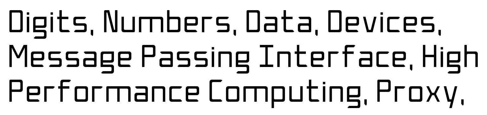

## Typefaces & Fonts

### Digital Scientifika (2020)
This font was originally created for a design proposal which ended up being rejected.  So, this font is now hapily released to the public under the CC BY-NC-ND license.

[Download the OTF](res/digital-scientifika.otf)
