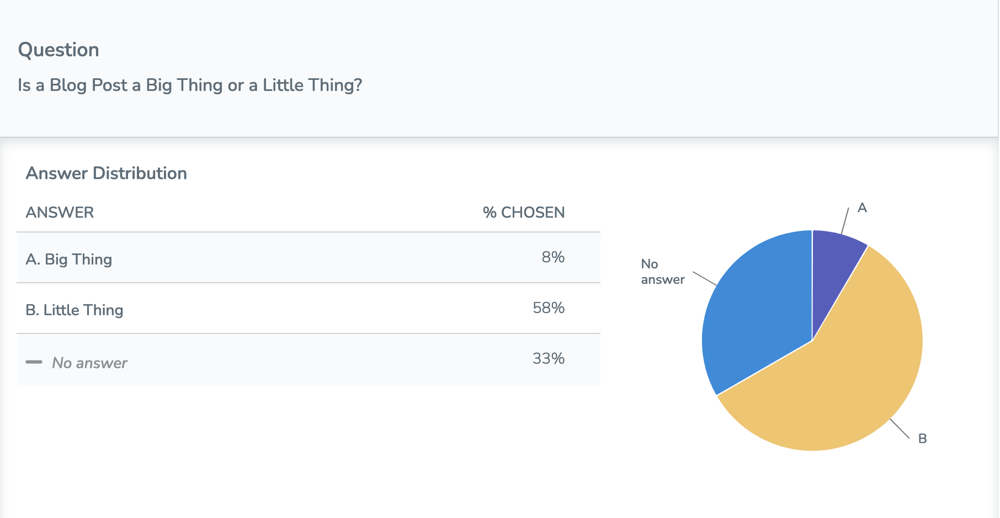

# Teaching Artifacts

## Artifact 1: APA Citation Class Activity

This activity leverages fun and integration of technology in the classroom.  At the mid point of the lecture, students are prompted to pull out their phones and join the NearPod session.  A screenshot of an example of a type of source is projected, and the students are then asked whether the source's title would be italicised or not - that is, whether it is a big thing, which would be italicised, or a little thing, which is not.  The following slide shows the correct answer and shows a full citation for the source shown on the slide preceeding it, as well as noting any other points of interest in the citation.  This offers not only an opportunity for students to think critically about sources but also to see in context the other parts of the citation which they would need to be aware of.  Since I post slides, this deck provides a memorable example which students will know that they can go back and refer to if they need a refresher on citing certain types of sources.

## Artifact 2: Bell-ringer Word Cloud Activity

Lets me establish a baseline for student understanding of a topic, as well as provide a launching off point for class discussions.

## Artifact 3: Topic Generation Activity

Yeah.  Typing their ideas into the slide deck live.
